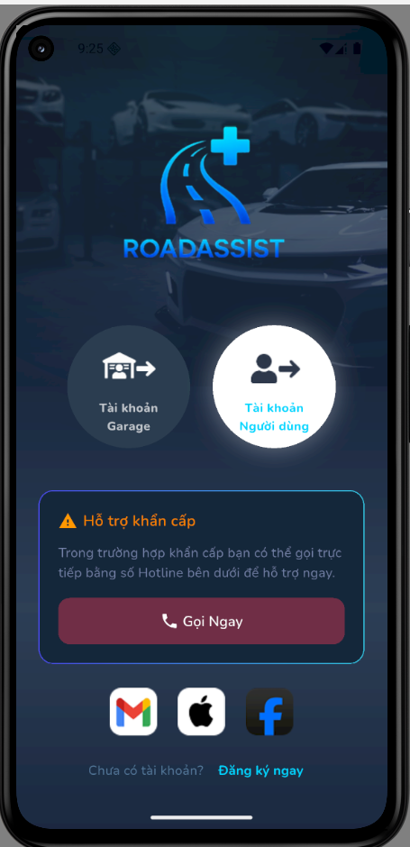
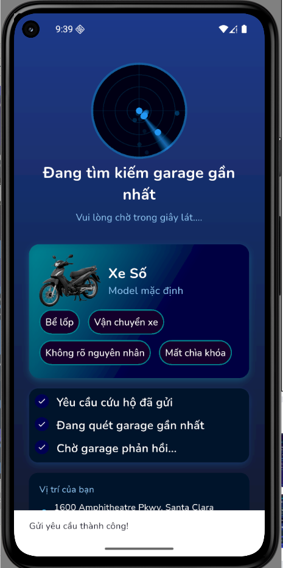

# 📱 Road Assist - Ứng Dụng Hỗ Trợ Gọi Garage Sửa Xe

🚀 Một ứng dụng di động hiện đại được xây dựng bằng **Flutter** (Frontend) và **Firebase** (Backend) nhằm kết nối người dùng với các garage sửa chữa xe.

## 📋 Mục Lục

- [Giới Thiệu](#-giới-thiệu)
- [Tính Năng](#-tính-năng)
- [Công Nghệ](#-công-nghệ)
- [Cấu Trúc Dự Án](#-cấu-trúc-dự-án)
- [Yêu Cầu Hệ Thống](#-yêu-cầu-hệ-thống)
- [Cài Đặt](#-cài-đặt)
- [Cấu Hình Firebase](#-cấu-hình-firebase)
- [Chạy Ứng Dụng](#-chạy-ứng-dụng)
- [Giao Diện Ứng Dụng](#-giao-diện-ứng-dụng)
- [Đóng Góp](#-đóng-góp)
- [License](#-license)

## 🎯 Giới Thiệu

**Road Assist** là một ứng dụng di động hỗ trợ người dùng nhanh chóng liên hệ với các garage sửa xe khi gặp sự cố trên đường.

Ứng dụng đóng vai trò là cầu nối giữa:
- ✅ **Người dùng** cần hỗ trợ
- ✅ **Garage** cung cấp dịch vụ sửa chữa

### Thông Tin Đồ Án

- **Tên đề tài:** Ứng dụng hỗ trợ gọi garage sửa xe – Road Assist
- **Môn học:** Lập trình Thiết bị Di động
- **Công nghệ:** Flutter
- **Hình thức:** Đồ án nhóm (4 sinh viên)
- **Giảng viên hướng dẫn:** Trương Quang Tuấn
- **Thời gian thực hiện:** 2 tháng

## ✨ Tính Năng

### 👤 Người Dùng (User)
- 🔐 Đăng ký, đăng nhập tài khoản
- 📍 Xem danh sách garage gần nhất
- 📞 Thực hiện cuộc gọi đến garage
- 📋 Xem thông tin chi tiết garage
- ⭐ Đánh giá và bình luận garage
- 💬 Chat trực tiếp với garage
- 📱 Quản lý thông tin cá nhân
- 🚗 Quản lý danh sách xe của mình
- 📊 Lịch sử các lần gọi hỗ trợ
- ❤️ Lưu garage yêu thích

### 🏪 Garage (Garage Owner)
- 🔐 Đăng ký, đăng nhập tài khoản
- 📊 Quản lý thông tin garage
- 📞 Nhận và xử lý cuộc gọi từ người dùng
- 💬 Chat với người dùng
- 📍 Quản lý loại phương tiện hỗ trợ
- ⏰ Quản lý giờ làm việc
- 📋 Lịch sử đơn hỗ trợ
- ⭐ Xem đánh giá từ khách hàng

### ⚙️ Hệ Thống
- 🔐 Lưu trữ dữ liệu người dùng và garage
- 📡 Đồng bộ dữ liệu thời gian thực
- 🔑 Quản lý xác thực người dùng
- 📍 GPS tracking realtime
- 🌐 Xác định vị trí garage gần nhất

## 🛠 Công Nghệ

### Frontend Stack
```json
{
  "framework": "Flutter 3.x",
  "language": "Dart",
  "ui": "Material Design",
  "state_management": "Provider",
  "local_storage": "SharedPreferences",
  "design": "Figma"
}
```

### Backend Stack
```json
{
  "platform": "Firebase",
  "database": "Cloud Firestore",
  "authentication": "Firebase Authentication",
  "storage": "Firebase Storage",
  "realtime": "Firebase Realtime Database"
}
```

### Key Technologies
| Thành phần | Công Nghệ |
|-----------|-----------|
| Ngôn ngữ | Dart |
| Framework | Flutter |
| Backend | Firebase |
| Database | Cloud Firestore |
| Authentication | Firebase Authentication |
| Storage | Firebase Storage |
| UI Design | Material Design |
| Design Tool | Figma |
| Location | Geolocator, Google Maps |

## 📁 Cấu Trúc Dự Án

```
lib/
├── 📁config/                          # Configuration
│   └── app_config.dart
│
├── 📁core/                            # Core Infrastructure
│   ├── 📁auth/
│   │   └── auth_state.dart
│   ├── 📁errors/
│   │   ├── 📁widgets/
│   │   │   └── emergency_card.dart
│   │   └── no_internet_screen.dart
│   ├── 📁network/
│   │   ├── network_service.dart
│   │   └── network_status.dart
│   ├── 📁providers/
│   │   ├── auth_provider.dart
│   │   ├── garage_notification_provider.dart
│   │   ├── navigation_provider.dart
│   │   └── selected_role.dart
│   ├── 📁routes/
│   │   ├── app_routes.dart
│   │   ├── navigation_observer.dart
│   │   ├── route_config.dart
│   │   ├── route_paths.dart
│   │   └── route_redirect.dart
│   ├── 📁services/
│   │   ├── 📁gps/
│   │   │   └── location_geolocator.dart
│   │   ├── 📁login/
│   │   │   └── login_option.dart
│   │   ├── 📁storage/
│   │   │   ├── firebase_storage_service.dart
│   │   │   └── storage_provider.dart
│   │   ├── call_hotline.dart
│   │   └── garage_scanner_service.dart
│   ├── 📁theme/
│   │   ├── app_palette.dart
│   │   ├── app_theme_type.dart
│   │   ├── app_theme.dart
│   │   └── theme_provider.dart
│   └── 📁utils/
│       └── geo_utils.dart
│
├── 📁data/                            # Data Layer
│   ├── 📁datasources/
│   │   ├── 📁local/
│   │   │   └── vehicle_constants.dart
│   │   └── 📁remote/
│   │       ├── auth_remote_datasource.dart
│   │       └── rescue_service.dart
│   └── 📁models/
│       ├── chat_model.dart
│       ├── completion_payload.dart
│       ├── garage_completion_payload.dart
│       ├── garage_model.dart
│       ├── message_model.dart
│       ├── rescue_request_model.dart
│       ├── review_model.dart
│       ├── user_input.dart
│       └── user_model.dart
│
├── 📁ui/                             # Presentation Layer
│   ├── 📁auth/
│   │   ├── 📁view/
│   │   │   ├── auth_role_screen.dart
│   │   │   ├── garage_register_screen.dart
│   │   │   ├── garage_success_screen.dart
│   │   │   ├── login_screen.dart
│   │   │   └── user_register_screen.dart
│   │   ├── 📁viewmodel/
│   │   │   ├── garage_register_vm.dart
│   │   │   ├── garage_success_vm.dart
│   │   │   ├── login_viewmodel.dart
│   │   │   └── user_register_vm.dart
│   │   └── 📁widgets/
│   │       ├── custom_text_field.dart
│   │       ├── day_selector.dart
│   │       ├── garage_info_card.dart
│   │       ├── password_text_field.dart
│   │       ├── phone_text_field.dart
│   │       ├── section_header.dart
│   │       ├── service_chip.dart
│   │       ├── success_header.dart
│   │       ├── time_picker_field.dart
│   │       └── vehicle_type_item.dart
│   │
│   ├── 📁call/
│   │   ├── 📁extensions/
│   │   │   └── call_extension.dart
│   │   ├── 📁models/
│   │   │   └── call_model.dart
│   │   ├── 📁screens/
│   │   │   ├── call_screen.dart
│   │   │   ├── incoming_call_screen.dart
│   │   │   └── waiting_call_screen.dart
│   │   ├── 📁services/
│   │   │   ├── call_initiation_service.dart
│   │   │   └── call_service.dart
│   │   └── 📁widgets/
│   │       └── wave_form_painter.dart
│   │
│   ├── 📁garage/
│   │   ├── 📁account/
│   │   ├── 📁history/
│   │   ├── 📁home/
│   │   └── 📁review/
│   │
│   ├── 📁navigation/
│   │   ├── 📁configs/
│   │   ├── 📁view/
│   │   ├── 📁viewmodel/
│   │   └── 📁widgets/
│   │
│   ├── 📁user/
│   │   ├── 📁account/
│   │   ├── 📁chat/
│   │   ├── 📁garage/
│   │   ├── 📁history/
│   │   ├── 📁home/
│   │   └── 📁rescue/
│   │
│   ├── 📁shared/
│   │   ├── 📁skeleton/
│   │   └── 📁widgets/
│   │
│   └── 📁map/
│       ├── location_pick_result.dart
│       └── map_pick_screen.dart
│
├── app.dart                           # Root App Widget
├── firebase_options.dart              # Firebase Configuration
└── main.dart                          # Entry Point
```

## 📋 Yêu Cầu Hệ Thống

- **Flutter SDK**: >= 3.x
- **Dart SDK**: >= 2.17.x
- **Android**: API Level 21+
- **iOS**: iOS 11.0+
- **IDE**: Android Studio, VS Code hoặc XCode
- **Emulator/Device**: Android Emulator, iOS Simulator hoặc thiết bị thật
- **Firebase Account**: Để tạo project Firebase

## 🚀 Cài Đặt

### 1. Clone Repository

```bash
git clone https://github.com/TUANKIET0397/RoadAssist.git
cd RoadAssist
```

### 2. Cài Đặt Dependencies

```bash
flutter pub get
```

### 3. Cấu Hình Flutter (nếu cần)

```bash
# Check Flutter installation
flutter doctor

# Nếu gặp lỗi, chạy:
flutter doctor --android-licenses
```

## 🔐 Cấu Hình Firebase

### Bước 1: Tạo Firebase Project

1. Truy cập [Firebase Console](https://console.firebase.google.com)
2. Nhấn **Add Project**
3. Điền tên project: `Road Assist`
4. Chọn region phù hợp
5. Bấm **Create Project**

### Bước 2: Thêm Ứng Dụng Android

1. Trong Firebase Console, bấm **+ Add app**
2. Chọn **Android**
3. Điền Package name: `com.tuankiet0397.roadassist`
4. Tải file `google-services.json`
5. Đặt file vào: `android/app/google-services.json`

### Bước 3: Thêm Ứng Dụng iOS (Optional)

1. Bấn **+ Add app** → **iOS**
2. Điền Bundle ID: `com.tuankiet0397.roadassist`
3. Tải file `GoogleService-Info.plist`
4. Đặt file vào: `ios/Runner/GoogleService-Info.plist`

### Bước 4: Bật các Dịch Vụ Firebase

Trong Firebase Console, bấn **Build** và bật:

- ✅ **Authentication**
  - Chọn Sign-in methods: Email/Password
  - (Optional) Google, Facebook

- ✅ **Cloud Firestore**
  - Chọn region
  - Bắt đầu ở chế độ test (hoặc production)
  
- ✅ **Firebase Storage**
  - Cho lưu trữ ảnh, tệp

- ✅ **Realtime Database** (Optional)
  - Cho đồng bộ dữ liệu realtime

### Bước 5: Cấu Hình Security Rules (Firestore)

```javascript
rules_version = '2';
service cloud.firestore {
  match /databases/{database}/documents {
    // Users collection
    match /users/{userId} {
      allow read, write: if request.auth.uid == userId;
    }
    
    // Garages collection
    match /garages/{garageId} {
      allow read: if true;
      allow write: if request.auth.uid == resource.data.ownerId;
    }
    
    // Reviews collection
    match /reviews/{reviewId} {
      allow read: if true;
      allow create: if request.auth != null;
      allow update, delete: if request.auth.uid == resource.data.userId;
    }
    
    // Messages collection
    match /messages/{messageId} {
      allow read, write: if request.auth != null;
    }
  }
}
```

## 🎮 Chạy Ứng Dụng

### Chế Độ Development

#### Trên Android Emulator/Device
```bash
flutter run
```

#### Trên iOS Simulator/Device
```bash
flutter run -d ios
```

#### Chạy trên thiết bị cụ thể
```bash
# List thiết bị có sẵn
flutter devices

# Chạy trên thiết bị cụ thể
flutter run -d <device_id>
```

### Chế Độ Release

#### Android APK
```bash
flutter build apk --release
# Output: build/app/outputs/flutter-apk/app-release.apk
```

#### Android App Bundle
```bash
flutter build appbundle --release
# Output: build/app/outputs/bundle/release/app-release.aab
```

#### iOS App
```bash
flutter build ios --release
# Output: build/ios/iphoneos/Runner.app
```

## 🧪 Testing

### Chạy Unit Tests
```bash
flutter test
```

### Chạy Widget Tests
```bash
flutter test --verbose
```

### Chạy Integration Tests
```bash
flutter test integration_test/
```

## 📱 Giao Diện Ứng Dụng

<p align="center">
  
  &nbsp;&nbsp;&nbsp;&nbsp;&nbsp;&nbsp;
  
</p>

<p align="center">
  
  &nbsp;&nbsp;&nbsp;&nbsp;&nbsp;&nbsp;
  
</p>

## 📚 Tính Năng Chi Tiết

### Authentication
- Đăng ký tài khoản (User hoặc Garage)
- Đăng nhập với email/password
- Khôi phục mật khẩu
- Xác thực email

### User Features
- Tìm kiếm garage gần nhất (dựa trên vị trí GPS)
- Xem danh sách garage
- Chi tiết garage (giờ làm, dịch vụ, reviews)
- Gọi garage cấp cứu
- Chat với garage
- Đánh giá garage
- Lưu garage yêu thích
- Quản lý xe của mình
- Lịch sử gọi hỗ trợ

### Garage Features
- Quản lý thông tin garage
- Quản lý loại xe hỗ trợ
- Quản lý dịch vụ
- Quản lý giờ làm việc
- Nhận cuộc gọi từ user
- Chat với user
- Xem lịch sử hỗ trợ
- Xem đánh giá từ khách hàng

## 🏗 Architecture

### Kiến Trúc Layers

```
Presentation Layer (UI/Screens)
    ↓
ViewModel/Provider Layer (Business Logic)
    ↓
Service Layer (Use Cases)
    ↓
Data Layer (Repositories)
    ↓
Remote/Local Data Sources
    ↓
Firebase Backend
```

### Key Components

1. **Screens** - UI components
2. **ViewModels** - State management với Provider
3. **Services** - Business logic
4. **Repositories** - Data access
5. **Models** - Data classes
6. **Widgets** - Reusable UI widgets

## 🔒 Security Best Practices

- ✅ Firebase Authentication cho xác thực
- ✅ Firestore Security Rules
- ✅ HTTPS cho tất cả API calls
- ✅ Input validation
- ✅ Sensitive data encryption
- ✅ Secure token storage

## 📝 Code Style

- Tuân theo [Dart Style Guide](https://dart.dev/guides/language/effective-dart/style)
- Sử dụng `const` constructors khi có thể
- Null safety enabled
- Comprehensive documentation

## 🤝 Đóng Góp

Chúng tôi chào đón những đóng góp từ cộng đồng!

### Các Bước:
1. Fork repository
2. Tạo feature branch (`git checkout -b feature/AmazingFeature`)
3. Commit changes (`git commit -m 'Add some AmazingFeature'`)
4. Push to branch (`git push origin feature/AmazingFeature`)
5. Open Pull Request

## 📄 License

Dự án này được cấp phép dưới MIT License - xem chi tiết trong file [LICENSE](LICENSE)

## 👥 Tác Giả

**TUANKIET0397**
- GitHub: [@TUANKIET0397](https://github.com/TUANKIET0397)
- Repository: [Road Assist](https://github.com/TUANKIET0397/RoadAssist)

## 📞 Support

Nếu bạn gặp vấn đề, vui lòng:
1. Kiểm tra [Issues](https://github.com/TUANKIET0397/RoadAssist/issues)
2. Tạo issue mới với mô tả chi tiết
3. Đặt tiêu đề rõ ràng và thêm labels thích hợp

## 🙏 Cảm Ơn

- Flutter documentation
- Firebase documentation
- Material Design
- Dart language
- Tất cả contributors

---

**Last Updated**: 2026-06-07 | **Status**: 🟢 Active Development