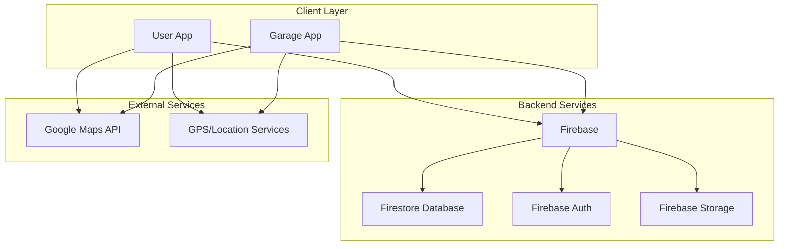
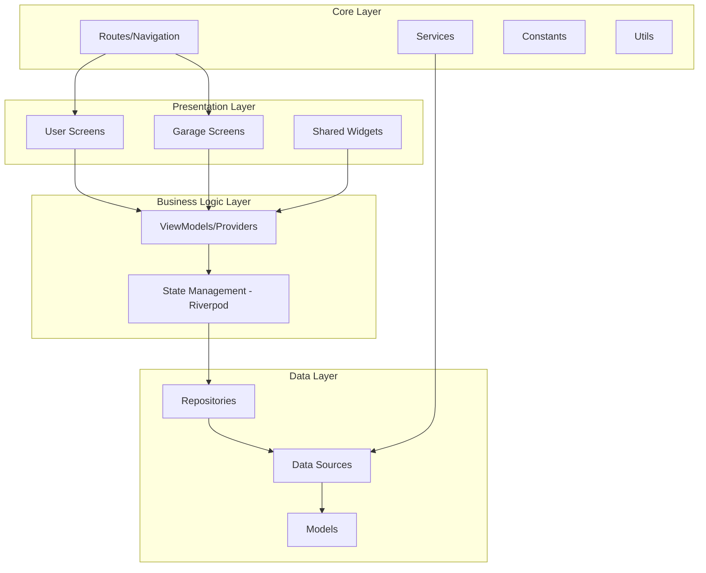
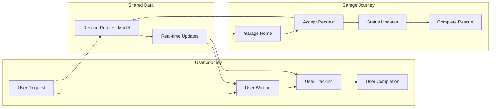
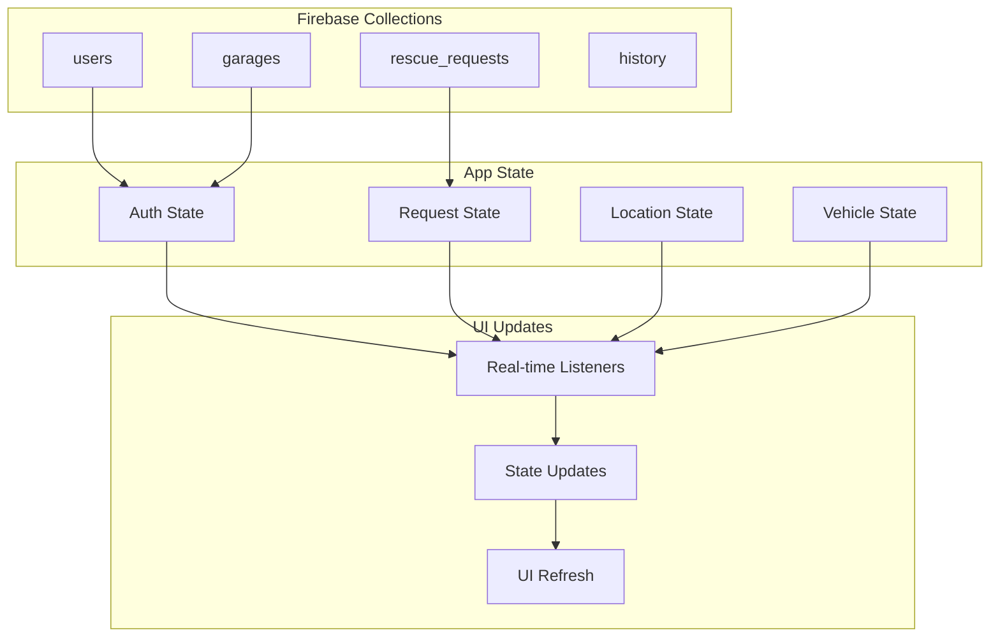
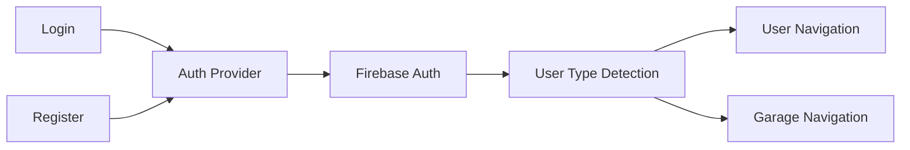
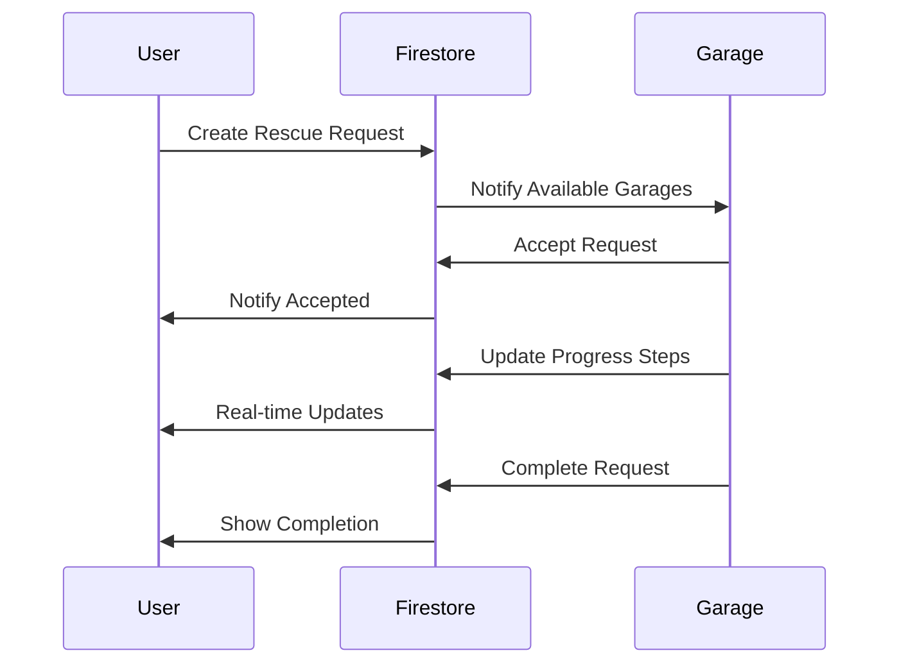
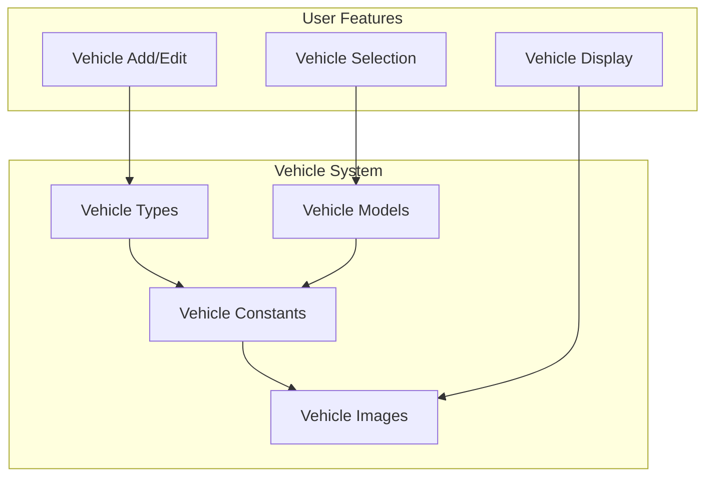
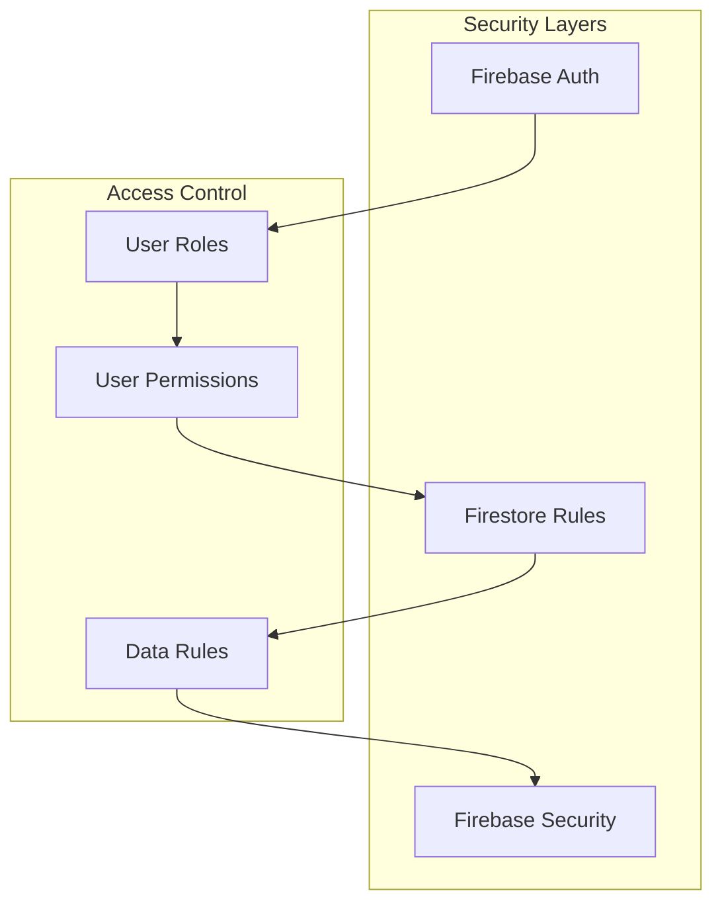
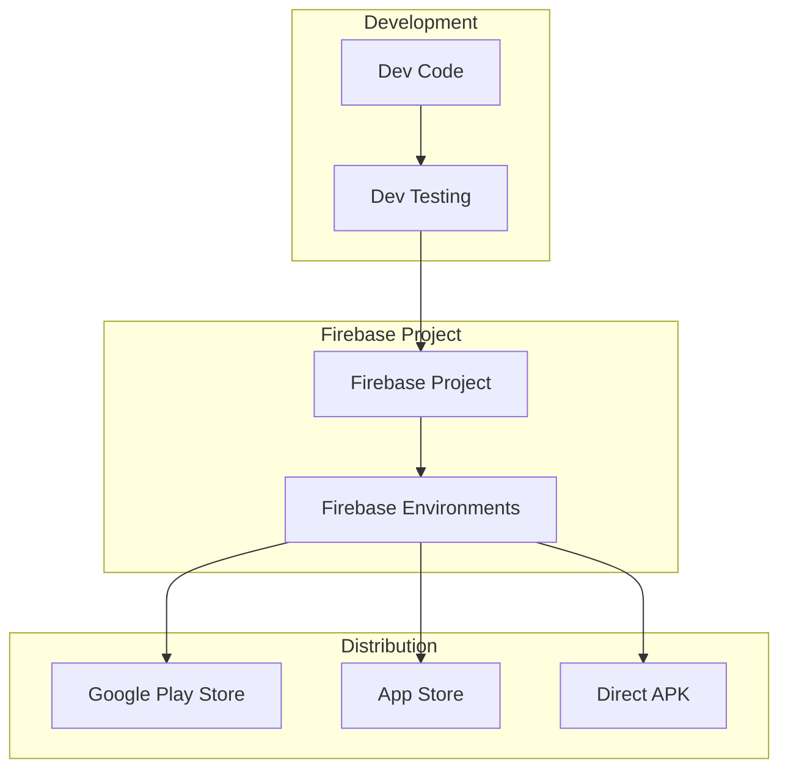
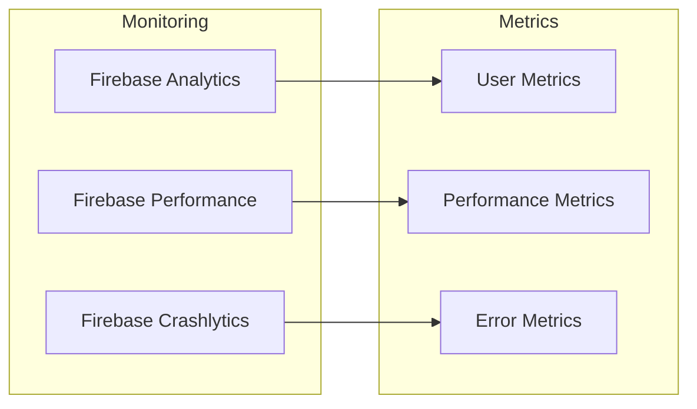

# RoadAssist System Architecture

## Overview
RoadAssist là một ứng dụng cứu hộ xe hai chiều kết nối giữa người dùng cần cứu hộ và các garage cung cấp dịch vụ cứu hộ.

## High-Level Architecture

## Mobile App Architecture

## User Flow Architecture

## Data Flow Architecture

## Technology Stack

### Frontend
- **Framework**: Flutter
- **Language**: Dart
- **State Management**: Riverpod
- **Navigation**: GoRouter
- **UI Components**: Material Design 3

### Backend
- **Database**: Cloud Firestore
- **Authentication**: Firebase Auth
- **Storage**: Firebase Storage
- **Real-time**: Firestore Streams

### External APIs
- **Maps**: Google Maps API
- **Location**: Geolocator Package
- **Geocoding**: Geocoding Package

## Key Components

### 1. Authentication System

### 2. Request Management

### 3. Vehicle Management

## Security Architecture

## Performance Considerations

### 1. Real-time Updates
- Firestore streams cho cập nhật realtime
- Optimized listeners để tránh excessive reads
- State caching với Riverpod

### 2. Image Management
- Firebase Storage cho vehicle images
- Local caching cho frequently used images
- Lazy loading cho image galleries

### 3. Location Services
- GPS optimization cho battery efficiency
- Location caching để giảm API calls
- Background location updates khi cần thiết

## Deployment Architecture

## Future Scalability

### Horizontal Scaling
- Microservices architecture preparation
- API Gateway implementation
- Load balancing considerations

### Feature Extensions
- Chat system integration
- Payment gateway
- Rating & review system
- Advanced analytics
- Push notifications

### Performance Optimization
- CDN implementation for images
- Database indexing optimization
- Caching layer implementation
- Background sync capabilities

## Monitoring & Analytics

---

*This architecture document provides a comprehensive overview of the RoadAssist system design, focusing on maintainability, scalability, and user experience.*